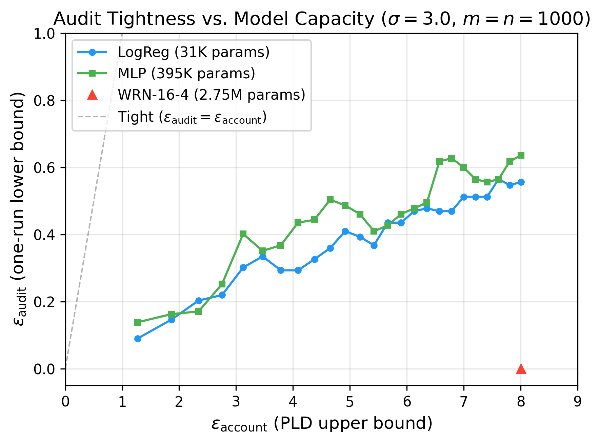

# DP-SGD Accounting and One-Run Auditing

This repository compares theoretical privacy accounting upper bounds with empirical
one-run auditing lower bounds for DP-SGD. It accompanies the CSC2412 report
*Theory vs. Empirics in DP-ML Auditing* by Seyed Mani Tahami and Connor Sicheri.

The experiments use black-box access to the final trained model. The auditor inserts
randomly included, mislabeled CIFAR-10 canaries and tries to recover their inclusion
bits from changes in loss between model initialization and the final model.

## Main result

We held the privacy-accounting inputs fixed across three architectures:

- 1,000 canaries, of which 489 were included by the seeded random draw
- logical batch size 500, so the sampling rate is approximately 1
- noise multiplier 3.0 and clipping norm 1.0
- 25 epochs and delta `1e-5`

Learning rates were tuned by architecture. All three runs therefore have the same PLD
accounting bound, while optimization behavior differs.

| Model | Parameters | Learning rate | PLD epsilon | Audit epsilon | Final loss |
|---|---:|---:|---:|---:|---:|
| Logistic regression | 31K | 0.5 | 8.00 | 0.56 | 1.99 |
| MLP, one 128-unit hidden layer | 395K | 1.0 | 8.00 | 0.64 | 1.95 |
| WRN-16-4 | 2.75M | 2.0 | 8.00 | 0.00 | 2.46 |

The smaller models learn enough under DP noise to expose a measurable membership
signal. The WRN remains near random-classification loss over the same 25 epochs.



An extended WRN run with noise multiplier 1.0 eventually reaches an audit lower bound
of 2.23, but only after the accounting upper bound has grown to 633.93.

## Repository contents

```text
configs/       Training and experiment configurations
experiments/   Training, audit, evaluation, and figure scripts
figures/       Generated report figures
paper/         Report source and compact metadata used for the figures
src/           DP-SGD, accounting, auditing, and evaluation code
tests/         Accounting and calibration tests
```

The one-run canary auditor and its exact calibration are implemented. The
worst-case-initialization, poisoning, and DP-Sniper modules are research scaffolds and
are marked as stubs in the code.

## Installation

Python 3.10 or newer is required.

```bash
python -m venv .venv
source .venv/bin/activate
python -m pip install --upgrade pip
python -m pip install -e ".[dev]"
```

PyTorch installation can be platform specific. If the command above cannot select the
appropriate CPU or GPU build, install PyTorch using its platform instructions first,
then rerun the editable install.

## Reproduce the published figures

Compact metadata for the reported runs is committed in `paper/data`, so regenerating
the figures does not require retraining the models:

```bash
python experiments/plot_paper_figures.py
```

The figures are written to `figures/`.

## Run an experiment

For example, to run the 25-epoch logistic-regression experiment:

```bash
python experiments/run_training.py \
  --config configs/experiments/eps8_logreg_25ep.yaml
```

Training downloads CIFAR-10 into `data/` and writes checkpoints and complete output
under `results/`. Both directories are excluded from Git because a full experiment
suite can occupy several gigabytes.

Other useful commands:

```bash
make test
make lint
make run-mnist-logreg
make run-cifar10-wrn
```

## Tests

```bash
pytest -q
ruff check src tests experiments
black --check src tests experiments
```

## Paper

The LaTeX source is in [`paper/paper.tex`](paper/paper.tex). It describes the access
model, one-run calibration, empirical results, and the conditional conversion from a
certified binary distinguishing advantage to RDP and zCDP lower bounds.

## Scope of the evidence

The reported audit values are empirical lower bounds for this canary construction and
black-box final-model interface. A zero or small lower bound means this auditor did not
certify more leakage in that run; it does not establish that the accountant is tight.

## License

Released under the MIT License. See [`LICENSE`](LICENSE).
